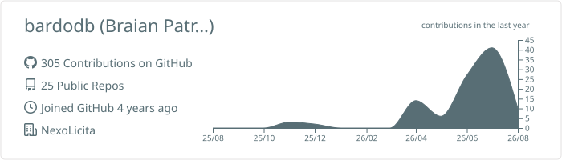
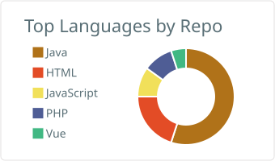
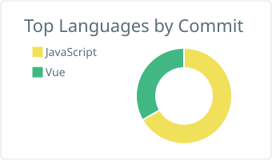

# Olá, eu sou o Braian! 👋

### Desenvolvedor Full Stack Pleno | Inovação & Soluções Web

Sou um desenvolvedor apaixonado por arquitetura de software, automação e por construir aplicações web robustas. Tenho focado bastante em criar ecossistemas eficientes.

##  Minha Stack Principal

  
  
  
  
  
  

##  Sobre mim

-  Atualmente trabalhando com desenvolvimento focado em **Inovação**.
-  Cursando **Análise e Desenvolvimento de Sistemas**.

###  Minhas Estatísticas

  
  
  

##  Como me encontrar

  
  

